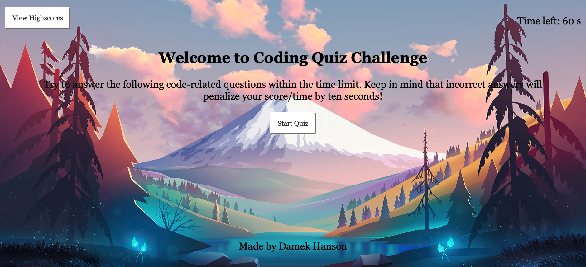

# Beginner Coding Quiz

## Description
Test your knowledge with this beginner coding quiz! You are given 60 seconds to answer all 8 questions. Wrong answers will penalize your score/time. Good luck! 

## Credits
Many thanks to my instructor and UC Berkeley for providing project parameters and code examples.

## Deployed Page

### Reactive page (Resize browser window)

[Deployed GitPage](https://damek-h.github.io/Beginner-Coding-Quiz/)
